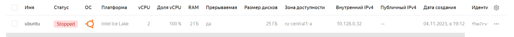
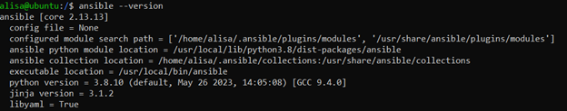
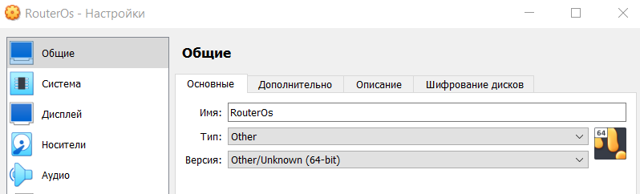
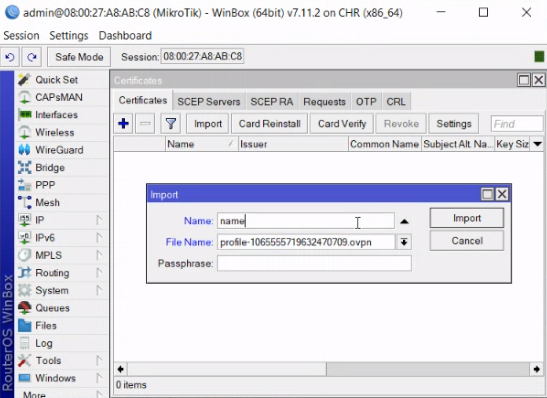
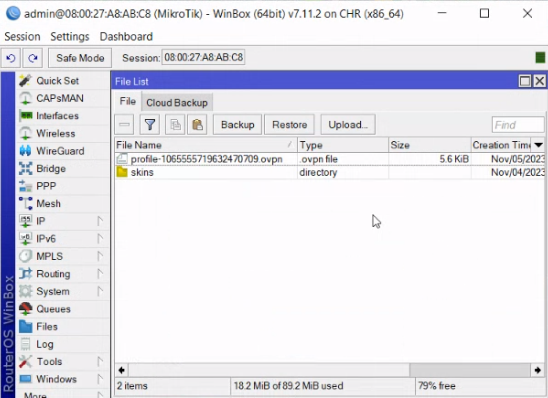
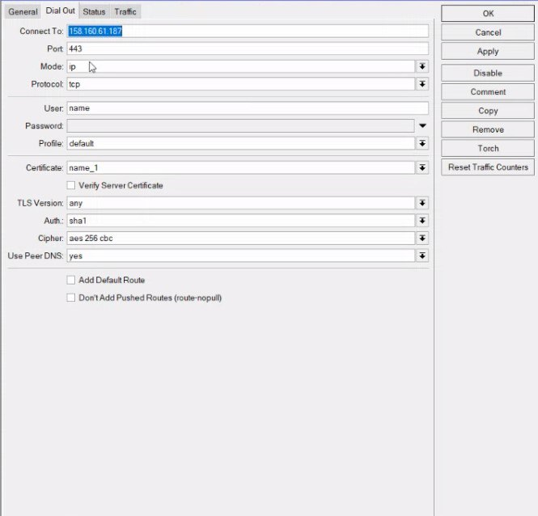
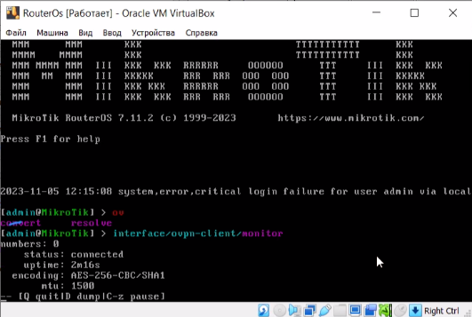

University: [ITMO University](https://itmo.ru/ru/)

Faculty: [FICT](https://fict.itmo.ru)

Course: [Network programming](https://github.com/itmo-ict-faculty/network-programming)

Year: 2023/2024 

Group: K34202

Author: Guliaeva Alisa

Lab: Lab1 

Date of create: 01.11.2023 

Date of finished: 06.11.2023

<h1>Отчет по лабораторной №1</h1>
<h2>"Установка CHR и Ansible, настройка VPN"</h2>

<h3>Цель:</h3>

 Развернуть виртуальную машину на базе платформы Yandex Cloud с установленной системой контроля конфигураций Ansible и установить CHR в VirtualBox

<h3>Ход работы:</h3>

<h4>Создание виртуальной машины в Yandex Cloud</h4>

Была создана виртуальная машина с ОС Ubuntu 20.04. На ВМ был выполнен вход по SSH.

С помощью следующих команд ВМ была обновлена, установлены Python, Ansible и OpenVPN:

<pre><code>sudo apt update & sudo apt upgrade</code></pre>
<pre><code>sudo apt install python3-pip</code></pre>
<pre><code>sudo pip3 install ansible</code></pre>

<h4>Установка OpenVPN</h4>

Для установки OpenVpn были введены следующие команды:

<pre><code>apt install ca-certificates wget net-tools gnupg</code></pre>
<pre><code>wget -qO - https://as-repository.openvpn.net/as-repo-public.gpg | apt-key add -</code></pre>
<pre><code>echo "deb http://as-repository.openvpn.net/as/debian focal main">/etc/apt/sources.list.d/openvpn-as-repo.list</code></pre>
<pre><code>apt install openvpn-as</code></pre>

После этого начнется загрузка файла с расширение .ovpn в котором уже содержатся ключи и сертификаты.

<h4>Установка CHR на Virtual Box</h4>

 С сайта https://mikrotik.com/download в формате vdi был скачан RouterOS. 

В VirtualBox при создании машины указываются следующие параметры:

В настройке ВМ в одном из адаптеров указывается тип подключения: Сетевой мост.

На https://mikrotik.com/download был скачен WinBox для упрощенной работы с CHR.

<h4>Настройка OpenVPN</h4>

Были загружены сертификаты:

Был создан openvpn интерфейс:

Проверка соединения:

<h3>Вывод:</h3>

В ходе работы была развернута виртуальная машина на базе платфформы Yandex Cloud, установлена Ansible и CHR в VirtualBox

