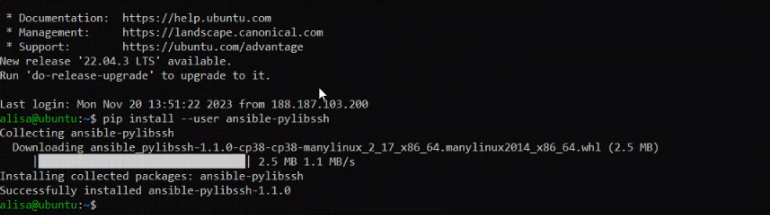
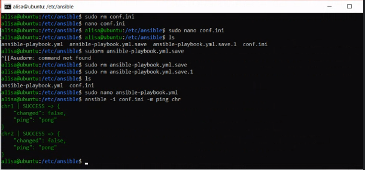
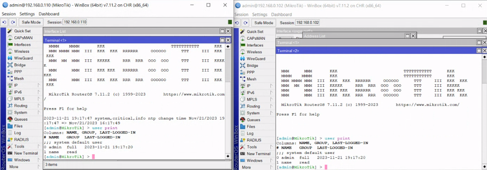
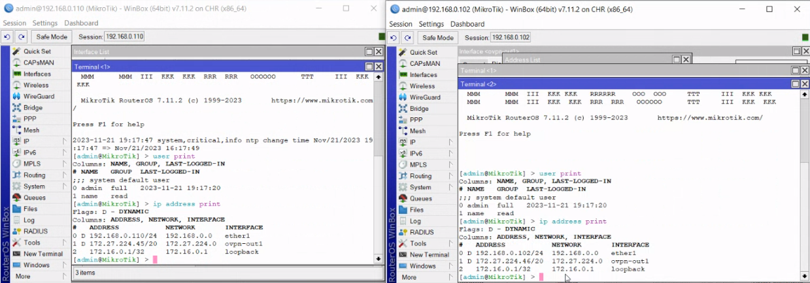
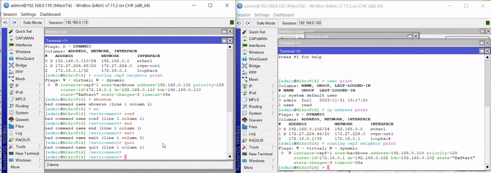
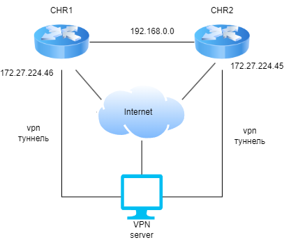

University: [ITMO University](https://itmo.ru/ru/)

Faculty: [FICT](https://fict.itmo.ru)

Course: [Network programming](https://github.com/itmo-ict-faculty/network-programming)

Year: 2023/2024 

Group: K34202

Author: Guliaeva Alisa

Lab: Lab2 

Date of create: 15.11.2023 

Date of finished: 23.11.2023

<h1>Отчет по лабораторной №2</h1>
<h2>"Развертывание дополнительного CHR, первый сценарий Ansible"</h2>

<h3>Цель:</h3>

 С помощью Ansible настроить несколько сетевых устройств и собрать информацию о них. Правильно собрать файл Inventory.

<h3>Ход работы:</h3>

<h4>Установка и настройка второго CHR</h4>

Созданная в lab1 виртуальная машина была склонирована. На склонированной машине был настроен ovpn.

<h4>Настройка CHR с помощью Ansible</h4>

Для настройки была установлена библиотека для работы по SSH

<pre><code>pip inastall --user ansible-pylibssh</code></pre>

Для настройки конфигураций были созданы файлы conf.ini и ansible-playbook.yml

<h5>conf.ini</h5>
<pre><code>
[chr]
chr1 ansible_host=172.27.224.45
chr2 ansible_host=172.27.224.46

[chr:vars]
ansible_connection=ansible.netcommon.network_cli
ansible_network_os=community.routeros.routeros
ansible_user=admin
ansible_ssh_pass=...
</code></pre>

<h5>ansible-playbook.yml</h5>
<pre><code>
---
- name:  CHR setting
  hosts: chr
  tasks:
    - name: Create users
      routeros_command:
        commands:
          - /user add name=name group=read password=name

    - name: Create NTP client
      routeros_command:
        commands:
          - /system ntp client set enabled=yes server=0.ru.pool.ntp.org

    - name: OSPF with router ID
      routeros_command:
        commands:
          #- /ip address add address=10.10.10.1/30 interface=ether3 network=10.10.10.0
          - /interface bridge add name=loopback
          - /ip address add address=172.16.0.1 interface=loopback network=172.16.0.1
          - /routing id add disabled=no id=172.16.0.1 name=OSPF_ID select-dynamic-id=""
          - /routing ospf instance add name=ospf-1 originate-default=always router-id=OSPF_ID
          - /routing ospf area add instance=ospf-1 name=backbone
          - /routing ospf interface-template add area=backbone auth=md5 auth-key=admin interface=ether1

    - name: Get facts
      routeros_facts:
        gather_subset:
          - interfaces
      register: output_ospf

    - name: Print output
      debug:
        var: "output_ospf"

</pre></code>

 Тестирование подключения: 

Результат выполнения файла с настройками конфигураций:

<h5>Конфигурации CHR после настройки:</h5>

CHR1

<pre><code>
# 2023-11-21 16:27:25 by RouterOS 7.11.2
# software id = 
#
/interface bridge
add name=loopback
/interface ovpn-client
add certificate=name_1 cipher=aes256-cbc connect-to=62.84.126.166 \
    mac-address=02:31:44:0E:5A:D6 name=ovpn-out1 port=443 user=name_2
/interface wireless security-profiles
set [ find default=yes ] supplicant-identity=MikroTik
/routing id
add disabled=no id=172.16.0.1 name=OSPF_ID select-dynamic-id=""
/routing ospf instance
add disabled=no name=ospf-1 originate-default=always router-id=OSPF_ID
/routing ospf area
add disabled=no instance=ospf-1 name=backbone
/ip address
add address=172.16.0.1 interface=loopback network=172.16.0.1
/ip dhcp-client
add interface=ether1
/routing ospf interface-template
add area=backbone auth=md5 auth-key=admin disabled=no interfaces=ether1
/system note
set show-at-login=no
/system ntp client
set enabled=yes
/system ntp client servers
add address=0.ru.pool.ntp.org
</pre></code>

CHR2

<pre><code>
# 2023-11-21 16:27:49 by RouterOS 7.11.2
# software id = 
#
/interface bridge
add name=loopback
/interface ovpn-client
add certificate=name_1 cipher=aes256-cbc connect-to=62.84.126.166 \
    mac-address=02:F6:5A:16:F4:3E name=ovpn-out1 port=443 user=name
/disk
set slot1 slot=slot1 type=hardware
set slot2 slot=slot2 type=hardware
set slot3 slot=slot3 type=hardware
set slot4 slot=slot4 type=hardware
set slot5 slot=slot5 type=hardware
set slot6 slot=slot6 type=hardware
/interface wireless security-profiles
set [ find default=yes ] supplicant-identity=MikroTik
/routing id
add disabled=no id=172.16.0.1 name=OSPF_ID select-dynamic-id=""
/routing ospf instance
add disabled=no name=ospf-1 originate-default=always router-id=\
    OSPF_ID
/routing ospf area
add disabled=no instance=ospf-1 name=backbone
/ip address
add address=172.16.0.1 interface=loopback network=172.16.0.1
/ip dhcp-client
add interface=ether1
/routing ospf interface-template
add area=backbone auth=md5 auth-key=admin disabled=no interfaces=\
    ether1
/system note
set show-at-login=no
/system ntp client
set enabled=yes
/system ntp client servers
add address=0.ru.pool.ntp.org
</pre></code>

Проверка настроек:

Схема:

<h3>Вывод:</h3>

В результате выполнения работы, с помощью Ansible, были настроены несколько сетевых устройств, создан файл Inventory.

