
University: [ITMO University](https://itmo.ru/ru/)

Faculty: [FICT](https://fict.itmo.ru)

Course: [Network programming](https://github.com/itmo-ict-faculty/network-programming)

Year: 2023/2024 

Group: K34202

Author: Guliaeva Alisa

Lab: Lab3 

Date of create: 26.11.2023 

Date of finished: 07.12.2023

<h1>Отчет по лабораторной №3</h1>
<h2>"Развертывание Netbox, сеть связи как источник правды в системе технического учета Netbox."</h2>

<h3>Цель:</h3>

 С помощью Ansible и Netbox собрать всю возможную информацию об устройствах и сохранить их в отдельном файле.

<h3>Ход работы:</h3>

<h4>Поднять Netbox на VM.</h4>

Был установлен и запущен Postgresql. Через него был создан user и база данных для netbox. 

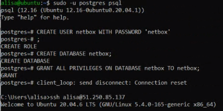

Затем был установлен redis и netbox.

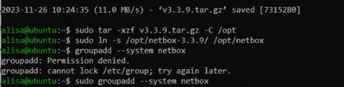
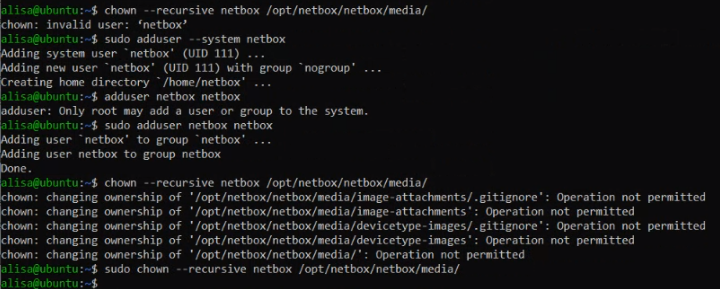

Далее была создана виртуальная среда и установлены все зависимости:

<pre><code>python3 -m venv /opt/netbox/venv</code></pre>
<pre><code>source venv/bin/activate</code></pre>
<pre><code>pip3 install -r requirements.txt</code></pre>

Был создан файл конфигурации

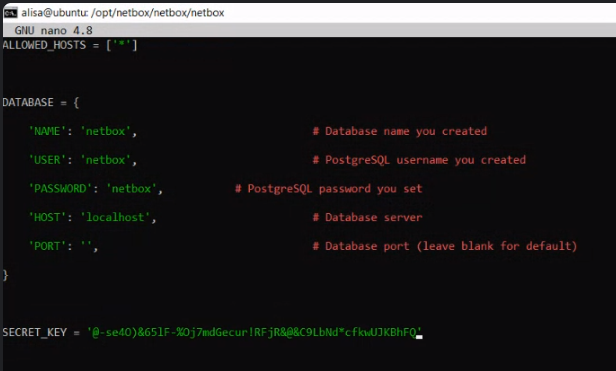

Были выполнены миграции:

<pre><code>python3 manage.py migrate</code></pre>

Создан суперюзер

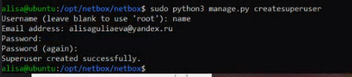

Также для заупуска были установлены и настроены Nginx и gunicorn:

<pre><code>sudo cp /opt/netbox/contrib/gunicorn.py /opt/netbox/gunicorn.py</code></pre>
<pre><code>sudo apt install -y nginx</code></pre>

После этого требовалось запустить systemd службу:

<pre><code>sudo cp /opt/netbox/contrib/*.service /etc/systemd/system/</code></pre>
<pre><code>sudo systemctl daemon-reload</code></pre>
<pre><code>sudo systemctl start netbox netbox-rq</code></pre>
<pre><code>sudo systemctl enable netbox netbox-rq</code></pre>

Файл netbox был отредактирован

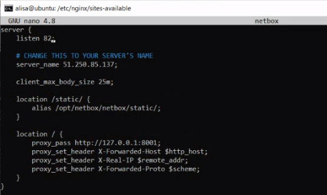

Далее была создана символическая ссылка и перезапущена служба

<pre><code>sudo rm /etc/nginx/sites-enabled/default</code></pre>
<pre><code>sudo ln -s /etc/nginx/sites-available/netbox /etc/nginx/sites-enabled/netbox</code></pre>
<pre><code>sudo systemctl restart nginx</code></pre>
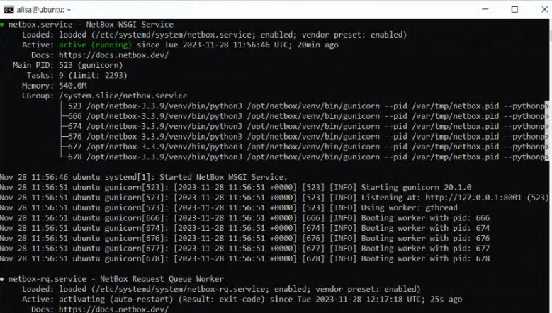

При переходе в браузере по адресу http://158.160.62.15:82 открывается netbox, в который можно зайти под суперпользователем, который был создан ранее.

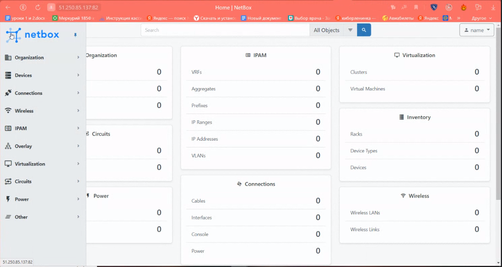

<h4>Заполнение информации в Netbox</h4>
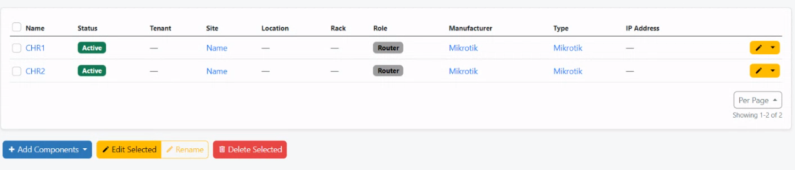

После был скачен netbox_devices.csv файл с описанием девайсов.

<h4>Написать сценарий, при котором на основе данных из Netbox можно настроить 2 CHR, изменить имя устройства, добавить IP адрес на устройство.</h4>

Файл netbox_devices.csv Был перенесен на сервер с ansible.

Был создан файл для изменения имени устройства. В качестве нового имени для роутеров будет установлено название из netbox_devices.csv, которое спарсится в файл new_playbook1.yml.

<h5>netbox_change_names_chr.yml</h5>
<pre><code>
---
- name: Setting up vars
  hosts: localhost
  tasks:
   - name: get data from csv
     community.general.read_csv:
       path: netbox_devices.csv
       key: "ID"
     register: routers
     delegate_to: localhost
   - name: checking
     debug:
      msg: 'Router {{ routers.dict }}'
   - name: setting vars
     copy:
      dest: '/etc/ansible/CHR{{ item }}.yaml'
      content: 'name: {{ routers.dict[ item ].Name }}'
     loop:
      - "1"
      - "2"

- name: Setting up CHR names
  hosts: chr
  vars_files:
  - CHR1.yaml
  - CHR2.yaml
    tasks:
  - name: change name
    community.routeros.command:
    commands:
    - /system identity set name={{ name }}

</pre></code>
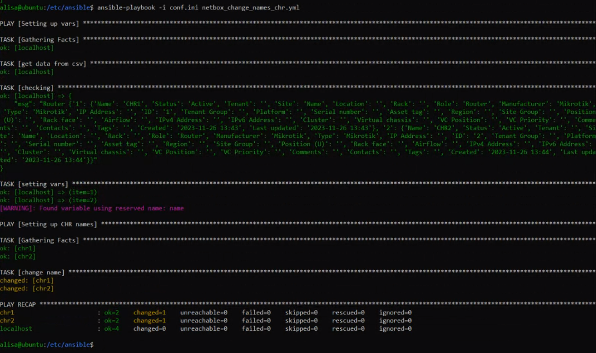

Результат:

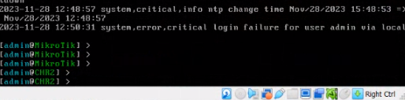

<h4>Написать сценарий, позволяющий собрать серийный номер устройства и вносящий серийный номер в Netbox.</h4>
<h5>netbox_settings.yml</h5>
<pre><code>
---
- name: RouterOS take name
  hosts: chr
  gather_facts: false
  become: true
  tasks:
   - name: Run a command
     community.routeros.command:
       commands:
         - /system identity print
     register: system_resource_print
   - name: make yml format
     ansible.builtin.shell:  echo '{{ system_resource_print }}'| grep -m1 -o '\[.*.]' | cut -d ","  -f1 | sed -e "s/^./>
- name: Put information to netbox
  hosts: localhost
  vars_files:
    - /etc/ansible/new_playbook1.yml
  tasks:
    - name: Obtain list of devices from NetBox
      netbox.netbox.netbox_device:
        netbox_url: 'http://158.160.62.15:82'
        netbox_token: '584e9e692b59ee7da214f8626c1a2ea360d44f6f'
        data:
          name: '{{ name }}'
          device_type: Mikrotik
          device_role: Router
          site: Name
        state: present
</pre></code>
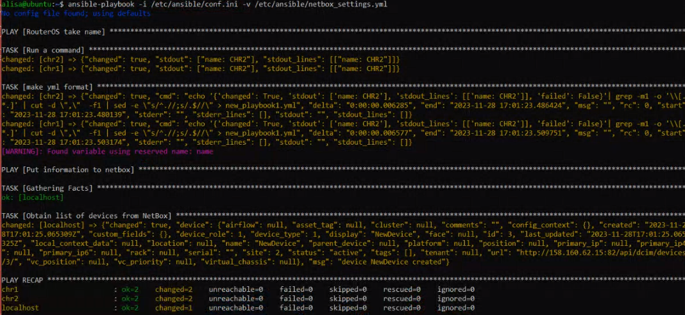

Результат:

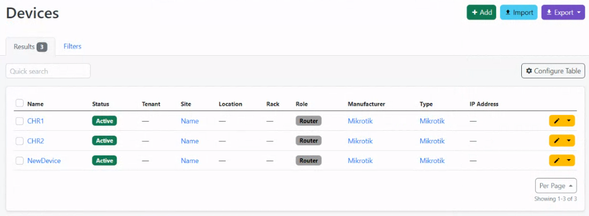

Проверка связности:

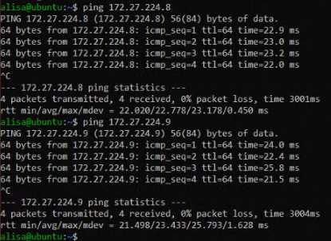
Схема:
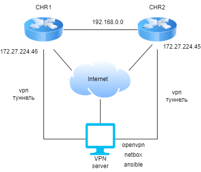
<h3>Вывод:</h3>

В результате работы была выполнена установка и настрйока netbox. Написаны ansible playbooks для взаимодействия ранее настроеных роутеров и netbox. Netbox показал себя как удобное средство для документирования сети.

