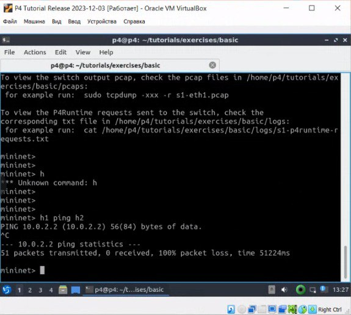
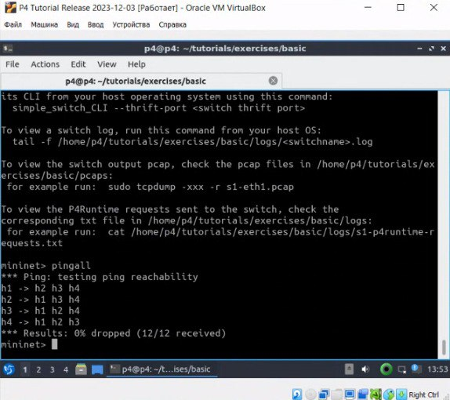
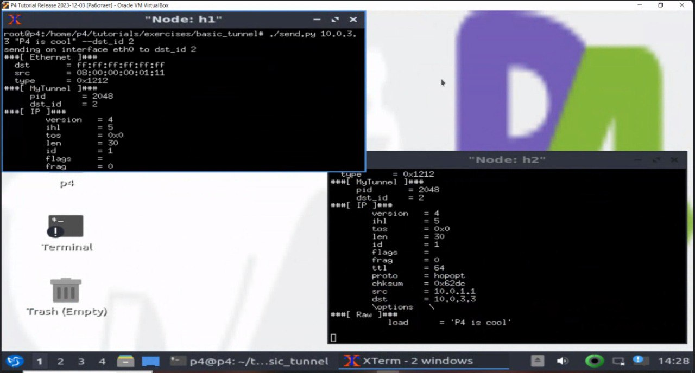
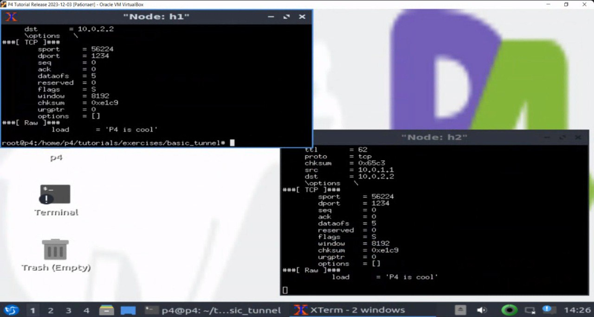

University: [ITMO University](https://itmo.ru/ru/)
Faculty: [FICT](https://fict.itmo.ru)
Course: [Network programming](https://github.com/itmo-ict-faculty/network-programming)
Year: 2023/2024
Group: K34202
Author: Guliaeva Alisa
Lab: Lab4
Date of create: 03.12.2023
Date of finished: 07.12.2023

# Отчет по лабораторной №4

## "Базовая 'коммутация' и туннелирование используя язык программирования P4"

### Цель:

Изучить синтаксис языка программирования P4 и выполнить 2 задания обучающих задания от Open network foundation для ознакомления на практике с P4.

### Ход работы:

#### Установка виртуальной машины.

Vagrant и VirtualBox уже были установлены на компьютер.
Был клонирован репозиторий https://github.com/p4lang/tutorials, в директории ./tutorial/vm-ubuntu-20.04 была выполнена команда vagrant up при включеном vpn.
После установки был выполнен вход под пользователем p4.

#### Implementing Basic Forwarding.

В терминале была выполнена команда make run, а затем проверена доступность узлов.



Для того, чтобы настроить доступность хостов, был изменен файл basic.p4.

Был обновлен парсер, который позволяет заполнять заголовки ethernet_t, ipv4_t.

```p4
parser MyParser(packet_in packet,
                out headers hdr,
                inout metadata meta,
                inout standard_metadata_t standard_metadata) {

    state start {
        /* TODO: add parser logic */
        transition parse_ethernet;
        #transition accept;
    }

    state parse_ethernet {
        packet.extract(hdr.ethernet);
        transition select(hdr.ethernet.etherType) {
            TYPE_IPV4 : parse_ipv4;
            default : accept;
        }
    }

    state parse_ipv4 {
        packet.extract(hdr.ipv4);
        transition accept;
    }
}
```

Дополнена функция ip4_forward: добавлено определение выходного порта, обновление адреса назначения и источника отправления пакета, а также уменьшено значение TTL.

```p4
action ipv4_forward(macAddr_t dstAddr, egressSpec_t port) {
        /* TODO: fill out code in action body */
        standard_metadata.egress_spec = port;
        hdr.ethernet.srcAddr = hdr.ethernet.dstAddr;
        hdr.ethernet.dstAddr = dstAddr;
        hdr.ipv4.ttl = hdr.ipv4.ttl - 1;
    }
```

Также обеспечено применение ipv4_lpm при наличии валидного заголовка ipv4.

```p4
apply {
        /* TODO: fix ingress control logic
         *  - ipv4_lpm should be applied only when IPv4 header is valid
         */
        if (hdr.ipv4.isValid()) {
            ipv4_lpm.apply();
        }
    }
```

Проверка скрипта:



#### Implementing Basic Tunneling.

В директориии ~/tutorials/exercises/basic_tunnel требовалось изменить файл basic_tunnel.p4
Были внесены изменения в файл basick_tunnel.p4.

Был добавлен парсер parse_myTunnel, который извлекает информацию из заголовка myTunnel. Если значение поля proto_id равно 0x800, то происходит переход к парсеру parse_ipv4.

```p4
    state parse_ethernet {
        packet.extract(hdr.ethernet);
        transition select(hdr.ethernet.etherType) {
            TYPE_IPV4 : parse_ipv4;
            TYPE_MYTUNNEL : parse_myTunnel;
            default : accept;
        }
    }
```

После этого парсер parse_ethernet был адаптирован так, чтобы извлекать или заголовок ipv4, или заголовок myTunnel в зависимости от значения поля etherType. Значение etherType, соответствующее заголовку myTunnel, установлено как 0x1212 в самом начале файла.

```p4
    state parse_myTunnel {
        packet.extract(hdr.myTunnel);
        transition select(hdr.myTunnel.proto_id) {
            TYPE_IPV4 : parse_ipv4;
            default : accept;
        }
    }
```

Также была определена таблица myTunnel_exact, ответственная за маршрутизацию пакетов myTunnel. Эта таблица вызывает функцию myTunnel_forward, которая устанавливает выходной порт для исходящих пакетов.

```p4
    #// TODO: declare a new action: myTunnel_forward(egressSpec_t port)
    action myTunnel_forward(egressSpec_t port) {
        standard_metadata.egress_spec = port;
    }
    #// TODO: declare a new table: myTunnel_exact
    #// TODO: also remember to add table entries!
    table myTunnel_exact {
        key = {
            hdr.myTunnel.dst_id: exact;
        }
        actions = {
            myTunnel_forward;
            drop;
            NoAction;
        }
        size = 1024;
        default_action = NoAction();
    }
    apply {
        #// TODO: Update control flow
        if (hdr.ipv4.isValid() && !hdr.myTunnel.isValid()) {
            ipv4_lpm.apply();
        }
        if (hdr.myTunnel.isValid()) {
            myTunnel_exact.apply();
        }
    }
```

Был написан депарсер.

```p4
control MyDeparser(packet_out packet, in headers hdr) {
    apply {
        packet.emit(hdr.ethernet);
        #// TODO: emit myTunnel header as well
        packet.emit(hdr.myTunnel);
        packet.emit(hdr.ipv4);
    }
}
```

В minilet была выполнена команда xterm h1 h2.
В результате были открыты два терминала. На h2 был поднят сервер командой ./receive.py.
На h1 была выполнена команда ./send.py 10.0.2.2 "P4 is cool" для отправки сообщения на h2.



Указав флаг --dst_id 2, но указав ip третьей машины пакет все равно дойдет до h2.



#### Схемы:

Схема Basic Forwarding:


Схема Basic Tunneling:


### Вывод:

В ходе выполнения лабороторной работы было изучено стандартное перенаправление пакетов, а также туннелирование. Также данные механизмы были реализованы с помощью языка P4.
